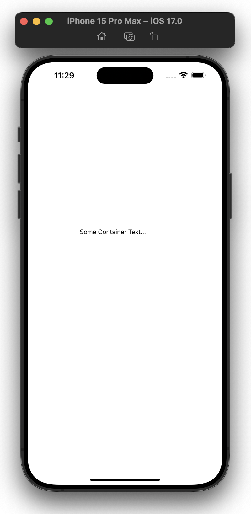
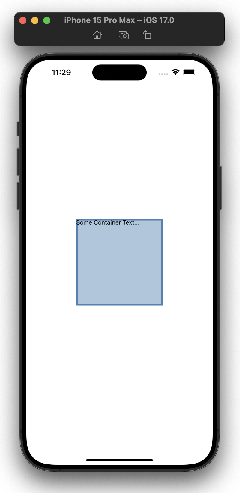

# exposed-view 👁 👁️

[](https://www.npmjs.com/package/exposed-view)

Simple react-native View wrapper, to expose its position / size via colors.

## Demo




## Installation

If you use expo, use:

```bash
expo install exposed-view
```

Otherwise, for npm use:

```bash
npm i exposed-view --save
```

And for yarn use:

```bash
yarn add exposed-view
```

## Usage

```tsx
<ExposedView color={"steelblue"} style={{ width: 200, height: 200 }}>
  <Text style={{ fontSize: 14 }}>Some Container Text...</Text>
</ExposedView>
```

## Toggle coloring

To make the coloring visible, make sure that at least one of the env variables `EXPOSE_VIEW` or `EXPO_PUBLIC_EXPOSE_VIEW` is set to `"true"` - otherwise it will render a normal react-native `View` instead, which doesn't include the coloring of course.

## Contribution

I mainly built this for myself, therefore the documentation is a bit minimalistic. Feel free to contribute via Pull Requests.
