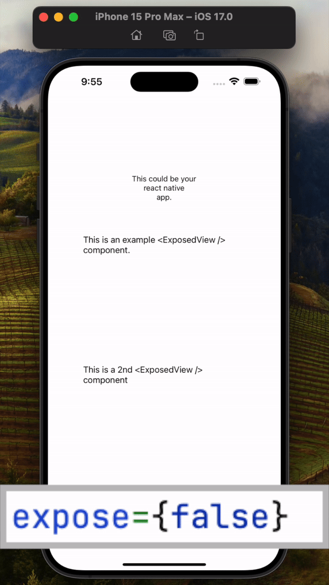
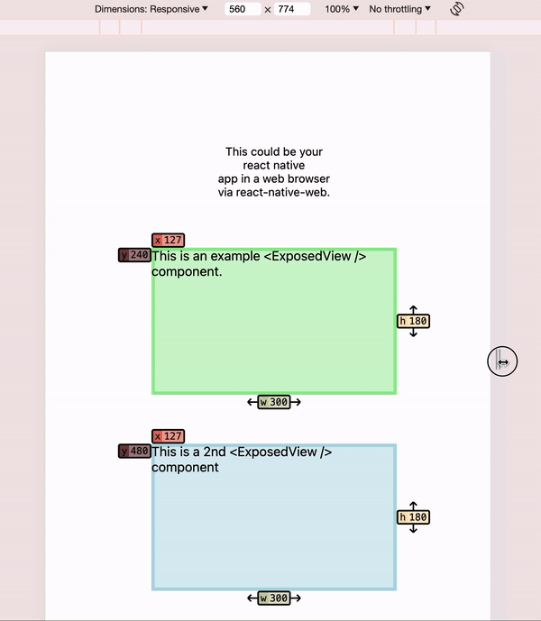

# exposed-view 👁 👁️

[](https://www.npmjs.com/package/exposed-view)

Simple react-native View wrapper, to expose its position / size via colors.

## Demo

<a href="https://youtube.com/shorts/xg_A93rB474?feature=share"></a>
<a href="https://youtube.com/shorts/F-05UaQo_gg?feature=share"></a>

## Live Demo
Check this [expo snack](https://snack.expo.dev/@maks-io/exposed-view-demo) out.

## Installation

If you use expo, use:

```bash
expo install exposed-view
```

Otherwise, for npm use:

```bash
npm i exposed-view --save
```

And for yarn use:

```bash
yarn add exposed-view
```

## Usage

First, wrap your main app with the context provider, like so:

```tsx
import { ExposedViewContextProvider } from "exposed-view";

export default function App() {
  return (
    <ExposedViewContextProvider expose={true}>
      <MyApp />
    </ExposedViewContextProvider>
  );
}
```

After that, you can use the `ExposedView` component across your app, like so:

```tsx
<ExposedView color={"steelblue"} style={{ width: 200, height: 200 }}>
  <Text style={{ fontSize: 14 }}>Some Container Text...</Text>
</ExposedView>
```

## Global Toggle / "Kill-switch"

To make **any exposing possible**, make sure that at least one of the env variables `EXPOSE_VIEW` or `EXPO_PUBLIC_EXPOSE_VIEW` is set to `"true"` - otherwise it will render a normal react-native `View` instead, which doesn't include the coloring of course.
The decision for this had performance reason for production environments - we recommend you to not set these env variables on production environments for simple deactivation of any visual highlighting of `ExposedView`s.
Instead, your app will fall back to using standard `View` components instead.
If you use this library inside an Expo Snack, this global toggle is automatically set to `true`, otherwise it could not be used there, since reading environment variables is not possible in Expo Snacks.

## Props for `ExposedViewContextProvider`

The props you set here define the behaviour of all `ExposedView` components (see below) within your app.

| prop                | required | default     | type                | description                                                                                                                                                                                                                                                                                       |
| ------------------- | -------- | ----------- | ------------------- | ------------------------------------------------------------------------------------------------------------------------------------------------------------------------------------------------------------------------------------------------------------------------------------------------- |
| `expose`            | yes      | `true`      | boolean             | Turn on any exposing functionality via this prop. The kill-switch (mentioned above) must be considered too - if you forget to set the corresponding env variable(s) you will not see any functionality.                                                                                           |
| `showWarnings`      | no       | `false`     | boolean             | Decides whether or not to show console.warns in case the highlighting css properties are overwritten by the View style itself, for instance, if a backgroundColor is set on an `ExposedView` it would warn, that in case of `expose === true` the highlighting backgroundColor would not be seen. |
| `showDimensions`    | no       | `true`      | boolean             | Decides whether or not to show dimensions, meaning width and height labels.                                                                                                                                                                                                                       |
| `showPosition`      | no       | `true`      | boolean             | Decides whether or not to show position, meaning x and y labels.                                                                                                                                                                                                                                  |
| `showUnit`          | no       | `false`     | boolean             | Decides whether or not to show the `px` unit inside labels.                                                                                                                                                                                                                                       |
| `widthPosition`     | no       | `"bottom"`  | `"top" \| "bottom"` | Decides where the width labels are shown.                                                                                                                                                                                                                                                         |
| `heightPosition`    | no       | `"right"`   | `"left" \| "right"` | Decides where the height labels are shown.                                                                                                                                                                                                                                                        |
| `fontSize`          | no       | `12`        | number              | Sets the fontSize of labels.                                                                                                                                                                                                                                                                      |
| `borderWidth`       | no       | `4`         | number              | Sets the borderWidth for highlighting View components. In case a View has a borderWidth set already, this borderWidth gets ignored.                                                                                                                                                               |
| `backgroundOpacity` | no       | `0.55`      | number              | Sets the opacity for the background of a highlighted View component - in other words, defines how much brighter the backgroundColor will be compared to the set `color`.                                                                                                                          |
| `showPrefix`        | no       | `true`      | boolean             | Decides if the prefixes like `w`, `h`, etc. should be shown inside labels or not.                                                                                                                                                                                                                 |
| `prefixForWidth`    | no       | `"w"`       | string              | Decides which prefix to show for width labels.                                                                                                                                                                                                                                                    |
| `prefixForHeight`   | no       | `"h"`       | string              | Decides which prefix to show for height labels.                                                                                                                                                                                                                                                   |
| `prefixForX`        | no       | `"x"`       | string              | Decides which prefix to show for x coordinate labels.                                                                                                                                                                                                                                             |
| `prefixForY`        | no       | `"y"`       | string              | Decides which prefix to show for y coordinate labels.                                                                                                                                                                                                                                             |
| `colorForWidth`     | no       | `"#c9cba3"` | string              | Decides which color to use for width labels.                                                                                                                                                                                                                                                      |
| `colorForHeight`    | no       | `"#ffe1a8"` | string              | Decides which color to use for height labels.                                                                                                                                                                                                                                                     |
| `colorForX`         | no       | `"#e26d5c"` | string              | Decides which color to use for x coordinate labels.                                                                                                                                                                                                                                               |
| `colorForY`         | no       | `"#723d46"` | string              | Decides which color to use for y coordinate labels.                                                                                                                                                                                                                                               |

## Props for `ExposedView` component

An `<ExposedView />` accepts all props that the standard `<View />` accepts.

Besides that, the following one prop is **mandatory**:
`color` (of type `CSSProperties["color"]`), which decides the "exposing" color for that `ExposedView`

Additionally, the following props are **optional**, and can be used, to override the corresponding setting from the `ExposedViewContextProvider`, for individual `ExposedViews`:
`expose`, `showWarnings`, `showDimensions`, `showPosition`, `widthPosition`, `heightPosition`, `showUnit`. The definition and behaviour of all these props can be seen in the table above.

## Future ideas / improvements

- Add intelligent avoidance of labels (positions + dimensions) overflowing the screen edges?
- Make labels only appear on hover for web?
- Make labels have half opacity, and only show fully on hover for web?
- Add possibility to show defined width/height vs. effective px width/height?
- Make position values be relative to parent?
- Add warning icon if style prop overwriting occurs?

## If you enjoy using this...

<a href="https://www.buymeacoffee.com/maks_io" target="_blank"></a>
